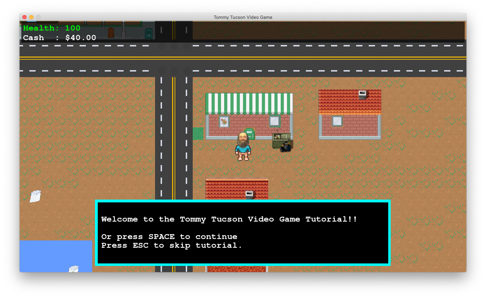

# The Tommy Tucson Video Game

[![Wiki][wiki-img]][wiki]

This is a 2D RPG game written in C++ using [SFML](http://sfml-dev.org/) for multimedia. This game runs on Windows, Mac and Linux.

## Website

The OFFICIAL website of Tommu Tucson.

[http://ttvg.online](http://www.ttvg.online)

## Wiki

For information about gameply or how to compile then check out the Wiki page. 

[https://github.com/zethon/ttvg/wiki](https://github.com/zethon/ttvg/wiki)

## Download

The latest stable releases can be downloaded on the website.

[http://ttvg.online](http://ttvg.online)

## Licensing

Unless otherwise noted, this code is licensed under the MIT license.

Artwork and audio files are all either public domain, GPL or used under fair use. 

## Links

Here is a list of some of the tools used to make this game:
* [bfxr](https://www.bfxr.net/)
* [Bosca Ceoil](https://boscaceoil.net/)

<!-- For more information visit [Dog Finger Studios](https://dogfinger.com). -->

  [wiki-img]: https://img.shields.io/badge/docs-Wiki-blue.svg
  [wiki]: https://github.com/zethon/ttvg/wiki
