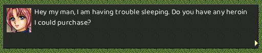
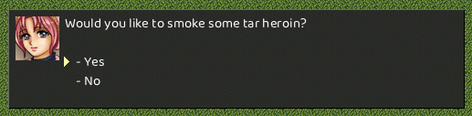

## 0. Introduction

**This feature is a work in process**. 

Lua support makes it easier for the community to add content to the game. This document talks about the Lua API and gives examples of how to extend the game using Lua.

Every scene has a *&lt;scene-name&gt;.lua* file which resides in `resources/lua` folder. This Lua file contains all code that is used by the scene and the scene's components. 

## 1. Scenes Events

Scenes will emit three events that can be caught in Lua. These are: `onInit`, `onEnter` and `onExit`. These are the default names and will be called automatically when the event is triggered. The names can be overriden using the JSON configuration like so:

```json
{
    "onInit": "scene_onInit",
    "onEnter": "scene_onEnter",
    "onExit": "scene_onExit",
}
```

Each event is passed a `Scene` object as the first parameter (see `Scene API` below).

A *Hello World* example using the configuration above might look like:

```lua
function scene_onInit(scene)
    print('Hello from '..scene:name..'!')
end

function scene_onEnter(scene)
    print('Entering scene '..scene:name..'!')
end

function scene_onExit(scene)
    print('Now leaving scene '..scene:name..'!')
end
```
</s>

### 1.1. Event Details

There are three callback functions for every scene.

#### `onInit(scene)`

This function is invoked when the scene is first loaded. This should not be confused with when the scene is entered, which can happen multiple times during the game. `onInit` is called only once when the game starts. Note that if game ends and the user starts a new game, `onInit` **will** be called at the start of that new game.

#### `onEnter(scene)`

This function is invoked when the player first enters the scene. This callback can be called multiple times in a single game since a user can enter and leave scenes multiple times.

#### `onExit(scene)`

This function is invoked when the playe first exits the scene. This callback can be also be called multiple times.

### 1.2. Scene API

#### `Scene.getPlayer()`

No arguments. Returns a `Player` object. **This object is only valid for the life of the scene.** 

**Example**
```lua
function onEnter(scene)
    local player = scene:getPlayer()
    local health = player:getHealth() - 2
    player:setHealth(health)
end
```

#### `Scene.name()`

No arguments. Returns the name of the current scene.

## 2. Player

The player object is accessible through `Scene.getPlayer` and offers the following API. As mentioned above, the player object is only valid for the life of the current scene. This means that the player object is **not** available during initialization (i.e. `onInit`) since at that time there is no current scene.

### 2.1 Player API

#### `Player.balance()`

No arguments. Returns the value of the player's current balance.

#### `Player.setBalance(balance)`

Sets the balance of the player to `balance`. This should be a numeric value.

#### `Player.health()`

No arguments. Returns the value of the player's current health.

#### `Player.setHealth(health)`

Sets the health of the player to `health`. This should be an **integer** value.

<!--

<hr/>

<s>
# Chapter 3. Resources

# Chapter 8. Modal Windows

 This library serves as means to display messages to the player such as dialog, or to prompt the player for questions. Modal Windows capture all input from the game demanding the user either make a choice or dismiss the window before moving on.

## 8.1. Static Modal Methods

Static methods can be used without declaring a `Modal` object, and provide basic functionality for common usages of modal windows.

### **`Modal.message(image,string)`** *[static]*



Displays an image on the left hand side of the widow with a string on the right hand side. This box can be dismissed with the space bar or the escape key.

#### **Arguments**

`image` - A pre-cached image to display on the left hand side. This image will automatically be scaled to 32x32.</br>
`string` -  The string to display

<hr/>

### **`Modal.yesno(image,string)` &rarr; `bool`** *[static]*



Displays an image on the left hand side of the widow with a string on the right hand side. The player is presented with a yes/no selection that can be changed with the up and down arrow keys, and selected with the space bar.

on the left hand side of the window, and `string` on the right hand side. The `image` must have been previously loaded in the [resource cache](#resource-cache).

#### **Arguments**

`image` - A pre-cached image to display on the left hand side. This image will automatically be scaled to 32x32.</br>
`string` -  The string to display

#### **Returns**
`boolean` - Returns `true` if the user selected "Yes", or `false` if the user selected "No".
</s>

<hr/>

## 8.2. Modal Objects

When more fine grained control is needed, the `Modal` class offers more options. For example:

```lua
local window = Modal.new(nil, "Please select A, B or C")
window:addOption(0, "Choice A")
window:addOption(1, "Choice B")
window:addOption(2, "Choice C")

local result = window.exec()
if (result == 0) then
    Modal.message("You selected A")
else if (result == 1) then
    Modal.message("You selected B")
else if (result == 2) then
    Modal.message("You selected C")
end
```

### 11.2.4. `Modal.new(` Class

```lua
local window = Modal.new()

```
-->